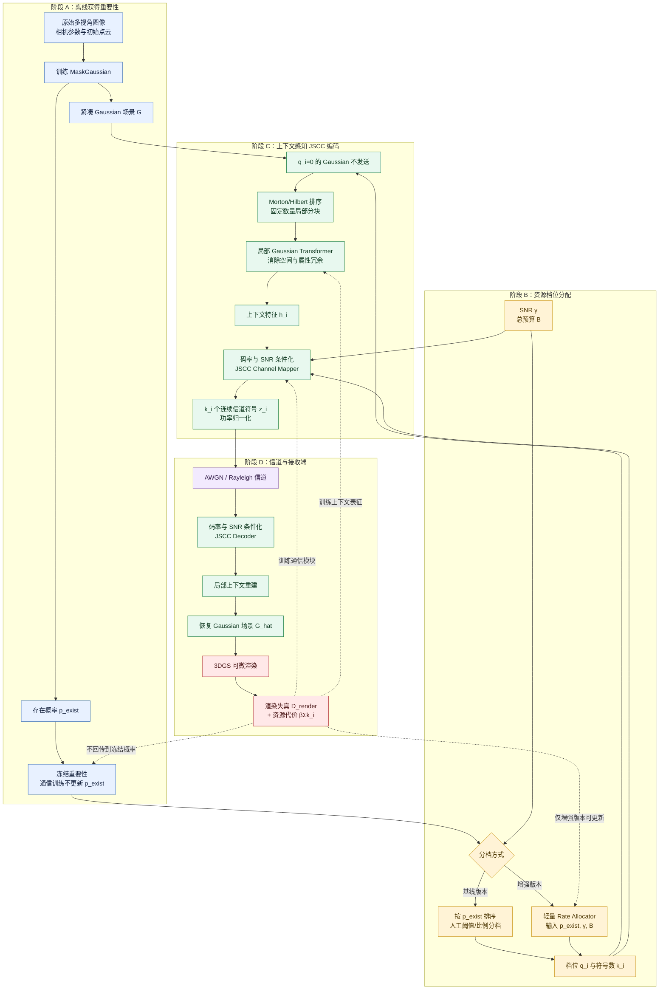
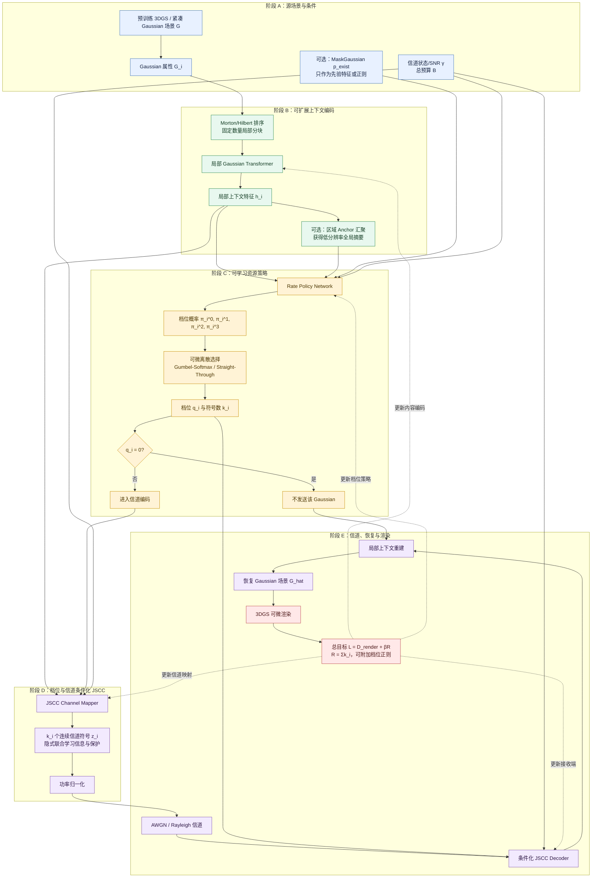
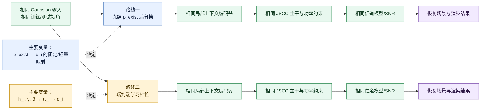

# MaskGaussian + JSCC：路线一与路线二流程图

## 统一符号与边界

- $G_i$：第 $i$ 个 Gaussian 的位置、尺度、旋转、不透明度和 SH/颜色等属性。
- $p_i^{exist}$：MaskGaussian 学到的存在概率。
- $q_i\in\{0,1,2,3\}$：资源档位；0 表示不传，1/2/3 表示低/中/高码率。
- $k_i$：档位对应的信道符号数，例如 $\{0,8,16,32\}$。
- $\gamma$：当前信道状态/SNR；$B$：总信道资源预算。
- $h_i$：结合邻域上下文后得到的 Gaussian 潜在特征。
- JSCC 输出的每个信道符号同时承担信息表达和抗噪保护，不预先硬拆成“信息符号”和“校验符号”。
- “端到端”指渲染损失能够穿过信道仿真回传到通信编码器和资源策略，不要求对全场景做全局注意力。

---

## 路线一：MaskGaussian 重要性先验 + 分离式资源分配



### 路线一的梯度边界

```text
固定分档版本：D_render → JSCC/上下文编码器
轻量分档版本：D_render → JSCC/上下文编码器/Rate Allocator
两种版本均不更新已经训练完成的 MaskGaussian p_exist
```

路线一回答的是：**如何把已有的“存在必要性”转化为通信资源，并在给定资源内完成抗噪传输。**

---

## 路线二：信道—渲染闭环中的端到端可学习档位



路线二回答的是：**在当前内容、邻域冗余、总预算和信道条件下，每个 Gaussian 应该处于哪个资源档位，才能使最终渲染率失真最优。**

---

## 两条路线的公平对比边界



## 核心区别摘要

| 项目 | 路线一 | 路线二 |
|---|---|---|
| 重要性来源 | 已训练完成的 MaskGaussian $p_i^{exist}$ | 上下文特征、SNR、预算；可选使用 $p_i^{exist}$ 作为先验 |
| 档位产生方式 | 人工排序/阈值，或轻量映射网络 | 可微离散策略网络端到端学习 |
| 信道是否改变原始重要性 | 不改变 $p_i^{exist}$ | 可以改变最终档位 $q_i$ |
| 上下文 Transformer 的职责 | 提取待传内容、消除源冗余 | 同时支撑内容编码与档位决策 |
| JSCC 的职责 | 在既定 $k_i$ 内隐式平衡信息与保护 | 在联合学习的 $k_i$ 内隐式平衡信息与保护 |
| 主要研究问题 | 已有存在重要性是否能有效指导通信资源 | 渲染感知的边际通信收益能否优于静态存在重要性 |
| 复杂度与稳定性 | 较低，模块边界清晰 | 较高，涉及离散决策和率失真联合优化 |

## 需要避免的歧义

1. $p_i^{exist}$ 表示 Gaussian 的存在必要性，不天然等于最佳通信码率。
2. $q_i/k_i$ 表示总信道资源，不直接规定多少符号是“信息”、多少是“保护”。
3. Transformer 用于上下文表征，不把原始 Attention 权重直接解释成重要性。
4. 两条路线都可采用局部窗口、序列化或层次化 Transformer，无需全场景 $O(N^2)$ 注意力。
5. 路线二的“端到端”可以只更新通信系统；是否同时更新原始 3DGS 参数应作为独立的系统边界说明。
